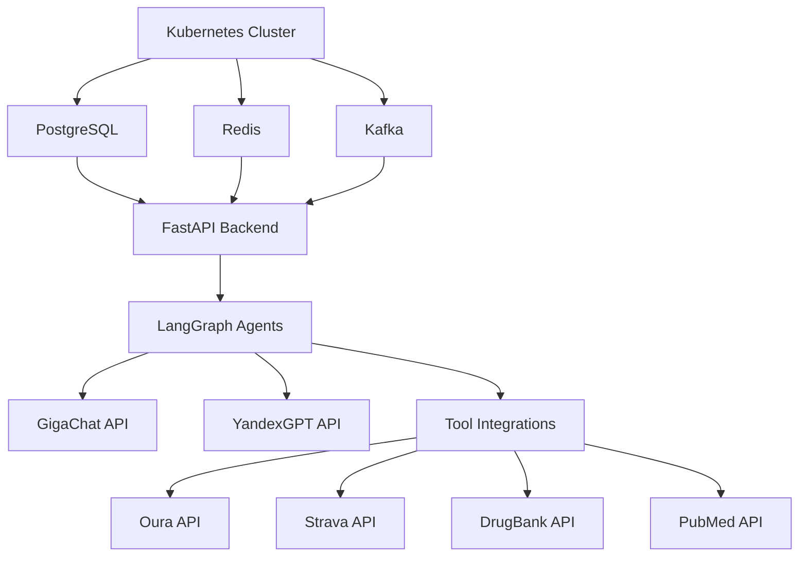

# BIOMAX AI — Technical Research Summary

## Резюме технического исследования

**Дата:** 2026-01-26  
**Версия:** 1.0  
**Статус:** Discovery Phase Complete

---

## 1. Executive Summary

Проведено комплексное техническое исследование по трём направлениям для BIOMAX AI v2.0:

| Направление | Документ | Статус |
|-------------|----------|--------|
| LangGraph Architecture | `langraph-architecture.md` | ✅ Complete |
| API Integrations | `api-integrations.md` | ✅ Complete |
| Kubernetes Infrastructure | `kubernetes-infrastructure.md` | ✅ Complete |

**Общий вывод:** Техническая реализация BIOMAX AI возможна с использованием существующих технологий. Основные риски связаны с доступностью некоторых API и стоимостью инфраструктуры.

---

## 2. Ключевые Findings

### 2.1 LangGraph Architecture

1. **Рекомендуемый паттерн:** Hierarchical Supervisor с группировкой агентов по командам (Health, Data, Safety, User)

2. **State Management:** Единая схема `BiomaxAgentState` с расширением `MessagesState`, custom reducers для контроля размера

3. **Persistence:** PostgresSaver с ConnectionPool для production (поддерживает до 1GB на checkpoint)

4. **LLM Integration:** 
   - Primary: GigaChat Pro (langchain-gigachat v0.3.12)
   - Fallback: YandexGPT (langchain-community)
   - Встроенный fallback chain

5. **Memory:** Комбинация checkpointing (PostgreSQL) + long-term memory (Qdrant vectors)

6. **Tool Design:** Pydantic schemas, comprehensive descriptions, error handling with retry

7. **Scalability:** Каждая команда агентов — отдельный subgraph, масштабируется независимо

### 2.2 API Integrations

| API | Статус | Auth | Rate Limits | Приоритет |
|-----|--------|------|-------------|-----------|
| **Oura Ring** | ✅ Готов | OAuth 2.0 | Не указаны | P0 |
| **Strava** | ✅ Готов | OAuth 2.0 | 200/15min | P0 |
| **PubMed** | ✅ Готов | API Key (опц.) | 10/sec | P1 |
| **DrugBank** | 💰 Платный | API Key | По тарифу | P0 |
| **MyFitnessPal** | ⚠️ Approval | OAuth 2.0 | 25K/day | P0 |
| **23andMe** | ⚠️ Approval | OAuth 2.0 | По договору | P2 |
| **INVITRO** | ❌ Нет API | PDF Parser | — | P1 |
| **TruDiagnostic** | ❌ Нет API | PDF Parser | — | P2 |
| **Cambridge Brain** | ⚠️ B2B only | OAuth 2.0 | По договору | P2 |

**Ключевые выводы:**
- 3 API готовы к немедленной интеграции (Oura, Strava, PubMed)
- 2 требуют PDF парсеры вместо API (INVITRO, TruDiagnostic)
- 3 требуют approval/контракт (MyFitnessPal, 23andMe, Cambridge)
- 1 платный, но критичный (DrugBank)

### 2.3 Kubernetes Infrastructure

1. **Архитектура:** Multi-namespace с разделением на core, agents, data, messaging, observability

2. **Databases:**
   - PostgreSQL (profiles, checkpoints)
   - ClickHouse (time series health data)
   - Qdrant (vectors, RAG)
   - Redis (cache, sessions)
   - Neo4j (knowledge graph)
   - MinIO (object storage)

3. **Message Queue:** Apache Kafka (KRaft mode) — выбран за высокий throughput (1.2M msg/sec) и replay capability

4. **API Gateway:** Kong с rate limiting, JWT auth, CORS

5. **Observability:** Prometheus + Grafana + Loki + Jaeger

6. **152-ФЗ Compliance:**
   - Данные на серверах в РФ
   - Encryption at rest и in transit
   - RBAC и audit logs
   - Network policies

7. **Resource Estimates:**
   - MVP (1K users): ~25 vCPU, ~60GB RAM, ~500GB storage
   - Scale (100K users): ~100 vCPU, ~250GB RAM, ~2TB storage

---

## 3. Риски и Blockers

### 3.1 Критические риски

| Риск | Вероятность | Влияние | Митигация |
|------|-------------|---------|-----------|
| DrugBank слишком дорогой | Medium | High | OpenFDA как бесплатная альтернатива |
| MyFitnessPal не одобрит API | Medium | Medium | Open Food Facts / USDA FoodData |
| INVITRO PDF плохо парсится | Medium | Medium | OCR + manual input fallback |
| GigaChat недоступен/нестабилен | Low | Critical | YandexGPT fallback готов |

### 3.2 Технические blockers

| Blocker | Статус | Action Required |
|---------|--------|-----------------|
| DrugBank license | 🔴 Нужна покупка | Запросить trial/pricing |
| MyFitnessPal approval | 🟡 В процессе | Отправить заявку на API@myfitnesspal.com |
| 23andMe approval | 🟡 Не начат | Отправить заявку на bd@23andme.com |
| Cambridge Brain Sciences | 🟡 Не начат | Запросить B2B partnership |
| Cloud provider выбор | 🟡 Не начат | Сравнение Yandex/VK/Selectel |

### 3.3 Зависимости



---

## 4. Рекомендации по приоритизации

### 4.1 Phase 1: Foundation (Weeks 1-4)

```yaml
infrastructure:
  - Развернуть K8s кластер (Yandex Cloud рекомендуется)
  - Настроить PostgreSQL + Redis
  - Настроить Kong API Gateway
  - Настроить CI/CD (GitHub Actions + ArgoCD)

agents:
  - Реализовать BiomaxAgentState schema
  - Реализовать Orchestrator Agent (базовый)
  - Настроить GigaChat + YandexGPT integration

integrations:
  - Oura Ring (OAuth flow + basic endpoints)
  - Strava (OAuth flow + basic endpoints)
```

### 4.2 Phase 2: Core Agents (Weeks 5-8)

```yaml
agents:
  - Sleep Agent + Oura integration
  - Fitness Agent + Strava integration
  - Safety Agent + DrugBank integration
  - Research Agent + PubMed integration

infrastructure:
  - Kafka для async processing
  - Qdrant для RAG
  - ClickHouse для time series
```

### 4.3 Phase 3: Extended Agents (Weeks 9-12)

```yaml
agents:
  - Nutrition Agent (MFP или альтернатива)
  - Lab Interpreter Agent (PDF parser)
  - Genomics Agent (23andMe raw parser)
  - Longevity Agent (TruDiagnostic PDF)
  - Coach Agent

integrations:
  - MyFitnessPal (если одобрен) или Open Food Facts
  - INVITRO PDF parser
  - 23andMe raw data parser
```

### 4.4 Phase 4: Polish & Scale (Weeks 13-16)

```yaml
features:
  - Cognitive Agent (manual input → CBS API)
  - Data Scientist Agent
  - Integration Agent
  - Custom Protocol Agent

infrastructure:
  - Neo4j для knowledge graph
  - Autoscaling настройка
  - Security hardening
  - 152-ФЗ audit
```

---

## 5. Технический бюджет (оценка)

### 5.1 MVP (первые 3 месяца)

| Категория | Месяц | Комментарий |
|-----------|-------|-------------|
| **Инфраструктура (K8s)** | ~100K ₽ | Yandex Cloud Managed K8s |
| **Databases** | ~30K ₽ | PostgreSQL, Redis managed |
| **LLM API** | ~50K ₽ | GigaChat Pro (~1M токенов/день) |
| **DrugBank API** | ~$500 | Clinical API |
| **Домены, сертификаты** | ~5K ₽ | CloudFlare, Let's Encrypt |
| **Total MVP** | **~230K ₽/месяц** | |

### 5.2 Scale (100K users)

| Категория | Месяц | Комментарий |
|-----------|-------|-------------|
| **Инфраструктура** | ~400K ₽ | Expanded cluster |
| **Databases** | ~150K ₽ | ClickHouse, Qdrant cluster |
| **LLM API** | ~300K ₽ | Higher volume |
| **External APIs** | ~100K ₽ | DrugBank, potential MFP |
| **Total Scale** | **~950K ₽/месяц** | |

---

## 6. Архитектурные диаграммы

### 6.1 System Context

```
┌─────────────────────────────────────────────────────────────────────────────────┐
│                                    USERS                                         │
│  ┌─────────────┐  ┌─────────────┐  ┌─────────────┐                              │
│  │  Telegram   │  │   WebApp    │  │   Mobile    │                              │
│  │    Bot      │  │  (Future)   │  │  (Future)   │                              │
│  └──────┬──────┘  └──────┬──────┘  └──────┬──────┘                              │
└─────────┼────────────────┼────────────────┼─────────────────────────────────────┘
          │                │                │
          └────────────────┼────────────────┘
                           │
                           ▼
┌─────────────────────────────────────────────────────────────────────────────────┐
│                              BIOMAX AI PLATFORM                                  │
│                                                                                  │
│  ┌─────────────────────────────────────────────────────────────────────────┐    │
│  │                           API Gateway (Kong)                             │    │
│  └────────────────────────────────────┬────────────────────────────────────┘    │
│                                       │                                          │
│  ┌────────────────────────────────────┴────────────────────────────────────┐    │
│  │                      LangGraph Multi-Agent System                        │    │
│  │   ┌───────────────────────────────────────────────────────────────┐     │    │
│  │   │                     Orchestrator Agent                         │     │    │
│  │   └───────────────────────────────────────────────────────────────┘     │    │
│  │        │              │               │              │                   │    │
│  │   ┌────┴────┐    ┌────┴────┐    ┌────┴────┐    ┌────┴────┐             │    │
│  │   │ Health  │    │  Data   │    │ Safety  │    │  User   │             │    │
│  │   │  Team   │    │  Team   │    │  Team   │    │  Team   │             │    │
│  │   │(6 agents)│   │(4 agents)│   │(3 agents)│   │(1 agent)│             │    │
│  │   └─────────┘    └─────────┘    └─────────┘    └─────────┘             │    │
│  └─────────────────────────────────────────────────────────────────────────┘    │
│                                       │                                          │
│  ┌────────────────────────────────────┴────────────────────────────────────┐    │
│  │                          Data & Storage Layer                            │    │
│  │  PostgreSQL | ClickHouse | Qdrant | Redis | Neo4j | MinIO | Kafka       │    │
│  └─────────────────────────────────────────────────────────────────────────┘    │
│                                                                                  │
└──────────────────────────────────────────────────────────────────────────────────┘
          │                                                    │
          ▼                                                    ▼
┌─────────────────────────┐                    ┌─────────────────────────────────┐
│     LLM Providers       │                    │     External Integrations       │
│  ┌───────┐ ┌─────────┐  │                    │  ┌─────┐ ┌──────┐ ┌───────┐    │
│  │GigaChat│ │YandexGPT│  │                    │  │Oura │ │Strava│ │DrugBank│   │
│  └───────┘ └─────────┘  │                    │  └─────┘ └──────┘ └───────┘    │
└─────────────────────────┘                    │  ┌──────┐ ┌─────┐ ┌───────┐    │
                                               │  │PubMed│ │ MFP │ │23andMe│    │
                                               │  └──────┘ └─────┘ └───────┘    │
                                               └─────────────────────────────────┘
```

### 6.2 Data Flow

```
┌────────────┐     ┌────────────┐     ┌────────────┐     ┌────────────┐
│   User     │────▶│   Kong     │────▶│  FastAPI   │────▶│ LangGraph  │
│  Request   │     │  Gateway   │     │  Backend   │     │ Orchestrator│
└────────────┘     └────────────┘     └────────────┘     └─────┬──────┘
                                                               │
                         ┌─────────────────────────────────────┼─────────────────┐
                         │                                     │                 │
                         ▼                                     ▼                 ▼
                  ┌────────────┐                        ┌────────────┐    ┌────────────┐
                  │   Sleep    │                        │   Safety   │    │  Research  │
                  │   Agent    │                        │   Agent    │    │   Agent    │
                  └─────┬──────┘                        └─────┬──────┘    └─────┬──────┘
                        │                                     │                 │
                        ▼                                     ▼                 ▼
                  ┌────────────┐                        ┌────────────┐    ┌────────────┐
                  │  Oura API  │                        │ DrugBank   │    │  PubMed    │
                  │            │                        │    API     │    │    API     │
                  └─────┬──────┘                        └─────┬──────┘    └─────┬──────┘
                        │                                     │                 │
                        └─────────────────────────────────────┼─────────────────┘
                                                              │
                                                              ▼
                                                       ┌────────────┐
                                                       │  Synthesis │
                                                       │   Node     │
                                                       └─────┬──────┘
                                                              │
                                                              ▼
                  ┌────────────┐     ┌────────────┐    ┌────────────┐
                  │  Kafka     │◀────│ Store to   │◀───│   Safety   │
                  │  Queue     │     │    DBs     │    │   Review   │
                  └────────────┘     └────────────┘    └─────┬──────┘
                                                              │
                                                              ▼
                                                       ┌────────────┐
                                                       │  Response  │
                                                       │  to User   │
                                                       └────────────┘
```

---

## 7. Созданные артефакты

| Файл | Путь | Описание |
|------|------|----------|
| LangGraph Architecture | `docs/discovery/technical/langraph-architecture.md` | Архитектура мультиагентной системы, state management, примеры агентов |
| API Integrations | `docs/discovery/technical/api-integrations.md` | Спецификации всех API, auth, rate limits, примеры кода |
| Kubernetes Infrastructure | `docs/discovery/technical/kubernetes-infrastructure.md` | K8s архитектура, databases, observability, 152-ФЗ |
| Technical Summary | `docs/discovery/technical/technical-summary.md` | Данный документ — резюме и рекомендации |

---

## 8. Next Actions

### Immediate (This Week)

1. [ ] Запросить DrugBank trial/pricing
2. [ ] Отправить заявку на MyFitnessPal API
3. [ ] Выбрать cloud provider (Yandex vs VK vs Selectel)
4. [ ] Настроить базовый K8s кластер

### Short-term (2 Weeks)

1. [ ] Развернуть PostgreSQL + Redis
2. [ ] Настроить GigaChat + YandexGPT integration
3. [ ] Реализовать Orchestrator Agent skeleton
4. [ ] Интегрировать Oura Ring API

### Medium-term (1 Month)

1. [ ] Реализовать Sleep Agent
2. [ ] Реализовать Safety Agent
3. [ ] Настроить Kafka
4. [ ] Настроить CI/CD pipeline

---

## 9. Open Questions

1. **LLM выбор:** Достаточно ли качества GigaChat Pro для медицинских рекомендаций? Нужен ли fine-tuning?

2. **INVITRO партнёрство:** Стоит ли инвестировать в партнёрство для API, или PDF parser достаточен для MVP?

3. **Cambridge Brain Sciences:** Насколько критичен cognitive assessment для MVP? Можно ли начать с manual input?

4. **Cost optimization:** При масштабировании до 100K users — когда выгоднее переходить на dedicated hardware?

5. **Security audit:** Когда проводить внешний аудит безопасности для 152-ФЗ compliance?

---

## 10. Заключение

Техническое исследование показало, что BIOMAX AI v2.0 реализуем с использованием:

- **LangGraph** для мультиагентной оркестрации (15 агентов)
- **GigaChat Pro + YandexGPT** для российского рынка
- **Self-hosted Kubernetes** для 152-ФЗ compliance
- **Комбинации API + PDF parsers** для интеграций

**Ключевой вывод:** Можно начать разработку MVP с текущим набором технологий. Основные blockers — получение доступа к DrugBank (платный) и MyFitnessPal (approval). Для INVITRO и TruDiagnostic реализуем PDF парсеры.

**Рекомендуемый следующий шаг:** Переход к фазе Architecture с созданием детальных технических спецификаций и ADR.

---

*Документ подготовлен: Research Agent + Architect Agent + DevOps Agent*  
*Координация: Orchestrator Agent*  
*Дата: 2026-01-26*
